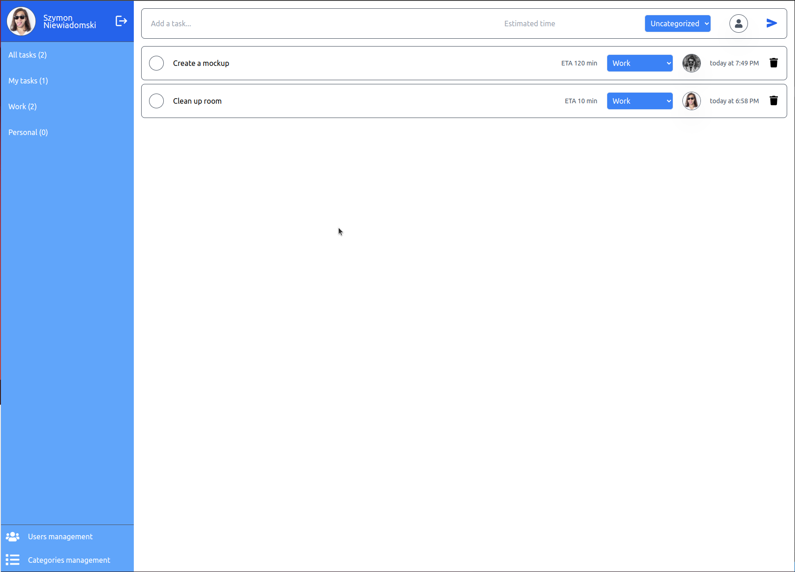
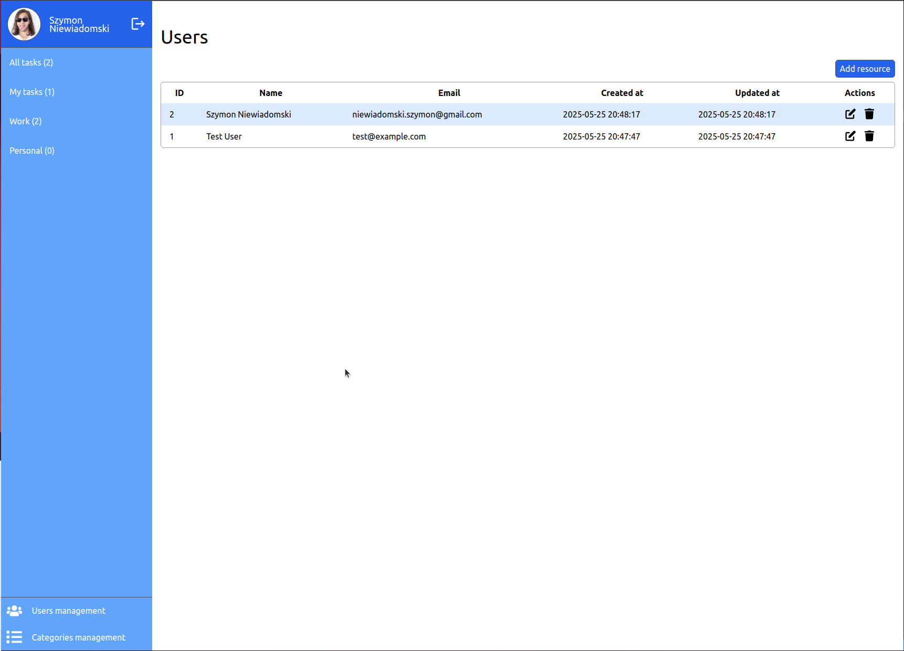

# Todo App

A todo application built with Laravel 11, Vue 3, and Inertia.js created for the recruitment task . This application provides comprehensive task management capabilities with user assignment, categorization.

## 🚀 Features

-   **Task Management**: Create, read, update, and delete tasks
-   **User Assignment**: Assign tasks to specific users
-   **Categories**: Organize tasks with custom categories
-   **Time Estimation**: Set estimated completion time in minutes
-   **Task Status**: Mark tasks as completed/incomplete
-   **User Management**: Admin functionality to manage users
-   **Category Management**: Create and manage task categories
-   **Authentication**: Secure login/logout system
-   **Soft Deletes**: Safely delete and recover tasks, categories, and users
-   **Responsive UI**: Modern interface built with Vue 3 and Tailwind CSS

## 📸 Screenshots

### Dashboard


_Main dashboard showing task management interface with categories, assignments, and task status_

### User Management


_User management interface for creating and managing application users_

## 🛠️ Tech Stack

### Backend

-   **Laravel 11**: PHP framework
-   **PHP 8.2+**: Server-side language
-   **SQLite/MySQL**: Database (configurable)
-   **Inertia.js**: Server-side rendering for SPAs

### Frontend

-   **Vue 3**: Progressive JavaScript framework
-   **Inertia.js Vue Adapter**: Seamless Laravel-Vue integration
-   **Tailwind CSS**: Utility-first CSS framework
-   **Vite**: Fast build tool and dev server
-   **TypeScript**: Type-safe JavaScript
-   **VueUse**: Vue composition utilities
-   **Date-fns**: Date manipulation library
-   **Oh Vue Icons**: Icon library

## 📋 Requirements

-   PHP 8.2 or higher
-   Composer
-   Node.js 18+ and Yarn
-   SQLite (default) or MySQL/PostgreSQL

## 🚀 Installation

1. **Clone the repository**

    ```bash
    git clone <repository-url>
    cd todo-app
    ```

2. **Install PHP dependencies**

    ```bash
    composer install
    ```

3. **Install JavaScript dependencies**

    ```bash
    yarn install
    ```

4. **Environment setup**

    ```bash
    cp .env.example .env
    php artisan key:generate
    ```

5. **Database setup**

    ```bash
    touch database/database.sqlite  # For SQLite
    php artisan migrate
    ```

6. **Start the development servers**

    Terminal 1 (Laravel):

    ```bash
    php artisan serve
    ```

    Terminal 2 (Vite):

    ```bash
    yarn dev
    ```

7. **Create your first user (optional)**
    ```bash
    php artisan user:create
    ```

The application will be available at `http://localhost:8000`

### Command Line Tools

-   `php artisan user:create` - Interactive user creation command
